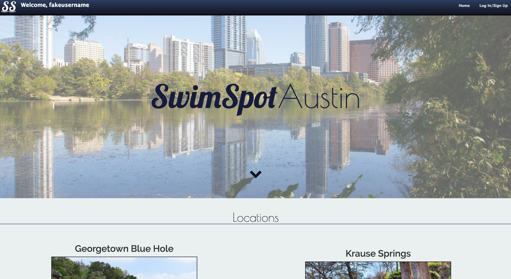

# SwimSpot Austin

## The App
This app allows users to view swimming holes in Austin and the surrounding areas. Users may login to post, edit or delete reviews they have written. A user does not need to be logged in to view swimming holes or reviews already written on them by other people.

## Technologies Used
Node.js, Express.js, Mongoose, mLab(MongoDB), CSS

We used the MEN stack (Node, Express, MongoDB) with EJS(HTML) to structure, route, and add functionality to all of the content of our application.

We used Mongoose to create and save data into our database on mLab.  mLab is the hub that houses all user-related data that exists from our application.

We used CSS to style everything and make it look professional.

There is also one scrolling feature that was created with front-end JavaScript.

Photoshop was used to create our logo which can be seen in the top left-hand corner of each page as well as the opacity of the background photo of the landing page.

## Approach Taken
Before we began coding, our group collaborated on the following: 
1. Brainstorming and choosing a project idea,
2. User Stories,
3. ERDs,
4. Wireframes,
5. Potential Bonus Features,
6. A Plan of Action and Goals/Deadlines

Next, we took a "divide and conquer" approach with the following steps:
1. Creating a local repository, pushing to GitHub and adding collaborators 
2. Creating MVC
3. Styling
4. Deploying

We worked as a group, pair programmed and worked individually throughout the project week.

## User Stories
* User lands on gallery homepage
* User signs up
* User logs in
* User views individual gallery pages (also do not have to be logged in for this to occur)
* User can add a review to a specific swimming hole
* User can edit and delete their comments

## Installation Instructions
1. Clone the repository to your local machine
2. Run `npm install` inside the directory to install all the dependecies used in this project.
3. Once the dependecies are installed, you can run `nodemon` in terminal and visit localhost:3000 to view the web app locally.
4. The website can be viewed online at https://swimspotaustin.herokuapp.com/ as well.

## Unsolved Problems
We had several bonus features we were unable to resolve or ran into a time crunch on.
* Upvotes/likes on reviews
* A hover feature on homepage images
* User's embedding/adding images to their reviews

